# Jira Service Management Lab

## Objective
Set up a helpdesk ticket queue in Jira Service Management and practice the core workflow of a support agent: creating and categorizing tickets, prioritizing based on business impact, tracking SLAs, documenting troubleshooting, communicating with the customer, and resolving requests.

## Environment
- Platform: Jira Service Management (free tier)
- Project: DL Tech Helpdesk (Service request management template)
- Fictional users: Bruce Wayne, Tony Stark, Patrick Jane, Theresa Lisbon (same company used across the Active Directory and Microsoft 365 labs)

## Setup

### 1. Request types
Reviewed the default request types provided by the IT Service Management template (Get IT help, Password Reset, Request a new account, Request admin access, Request new hardware, Request new software, Onboard new employees, Emailed request) and used them as-is to categorize tickets.

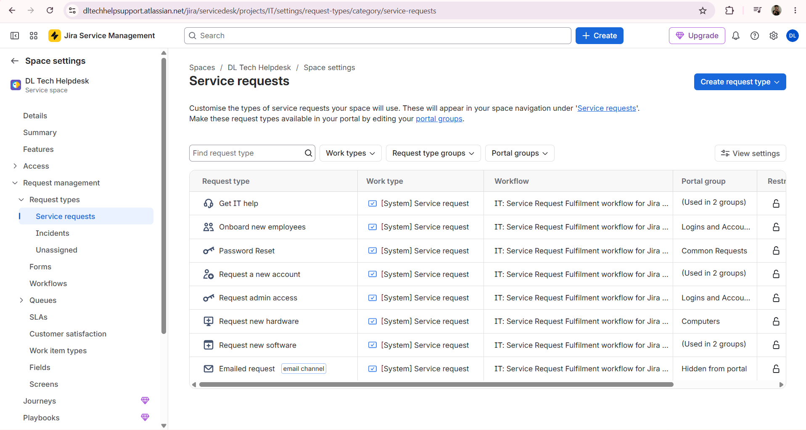

### 2. Creating tickets
Added the fictional users as Customers so they could be set as ticket reporters, then created 5 tickets simulating real helpdesk requests.

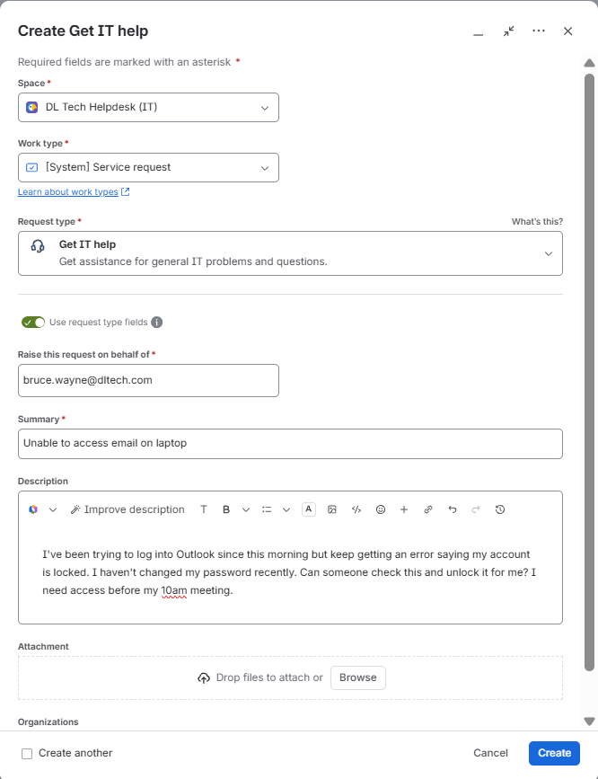

Note: the ticket for Tony Stark's password reset was categorized under "Request admin access" instead of "Password Reset," since the default Password Reset request type didn't include a description field needed to capture the full request.

### 3. Setting priority
Set a priority on each ticket based on business impact (not just how the requester described it), following standard ITSM practice where the support team finalizes priority rather than the requester.

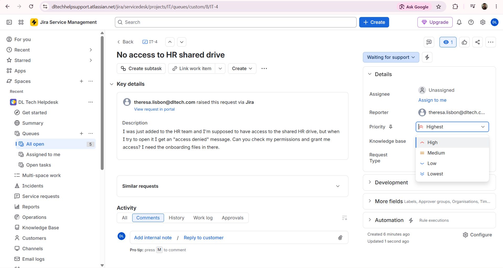

### 4. SLA policy
Created an SLA policy ("Time to resolution") with time targets based on priority: 4 hours for High/Highest, 8 hours for Medium, 24 hours for Low/Lowest. Configured the policy to start on ticket creation, pause while waiting on the customer, and stop when the ticket is marked Completed or Done.

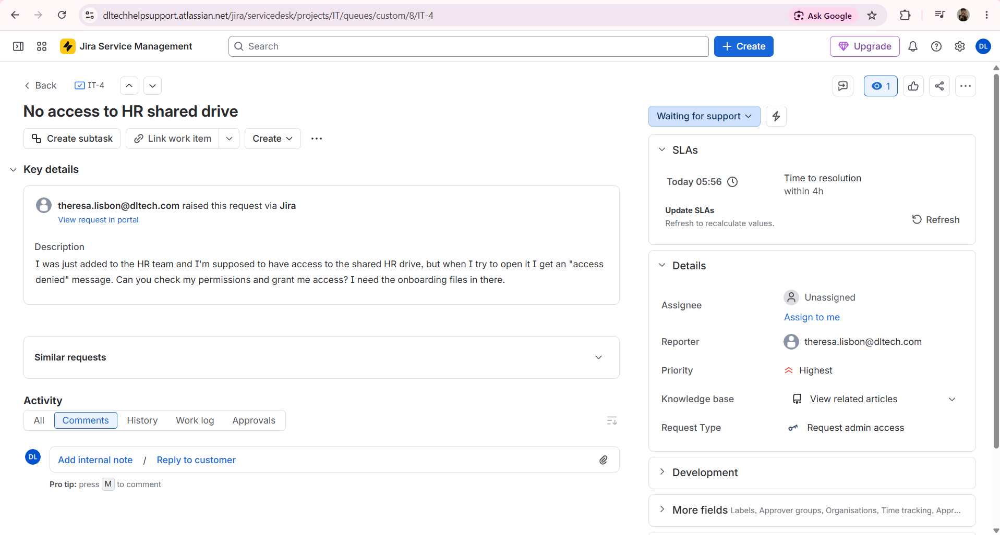

### 5. Queue overview
Confirmed priority and SLA countdowns are visible directly in the ticket queue, not just on individual tickets.

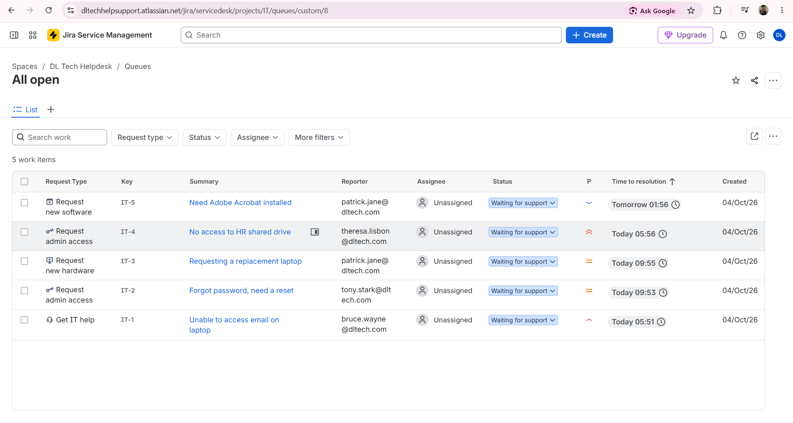

## Scenario: Working Theresa Lisbon's ticket (IT-4 — No access to HR shared drive)

**Problem:** Theresa was added to the HR team but got an "access denied" error trying to open the shared HR drive.

**Steps taken:**
1. Assigned the ticket to myself and moved it to In Progress.
2. Investigated the issue and documented the findings as an internal note (visible only to agents, not the customer).

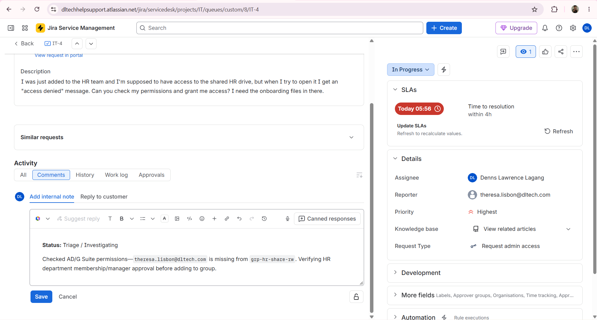

3. Replied to the customer separately, in a more professional and reassuring tone, letting her know the issue was being worked on.

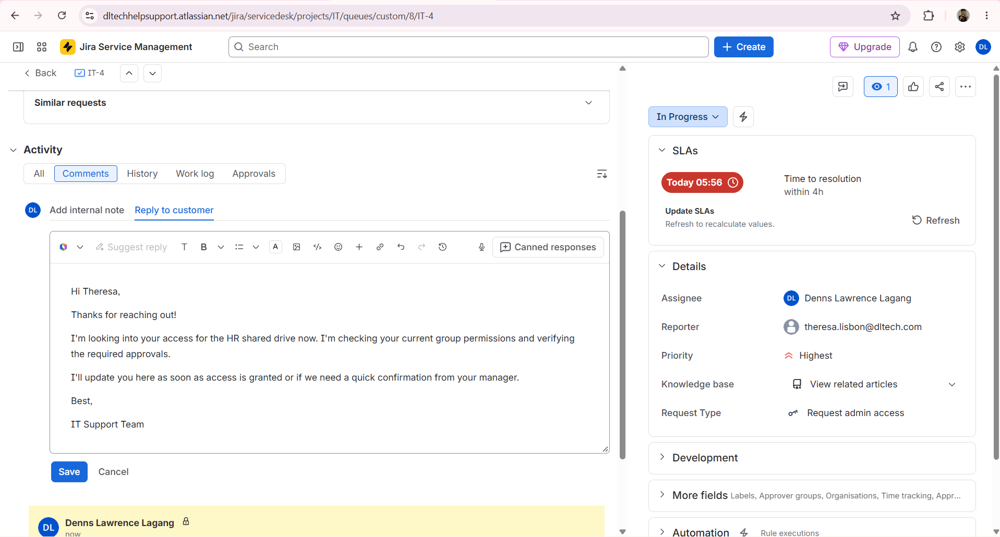

4. Both the internal note and the customer reply posted to the ticket's activity log.

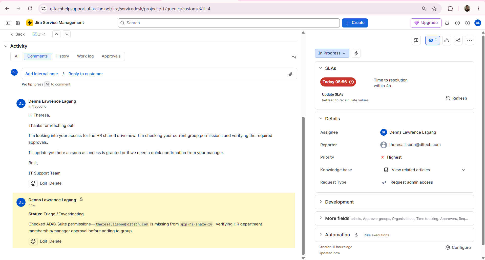

5. Once the fix was confirmed, resolved the ticket: added a closing internal note documenting exactly what was done, and a separate reply letting Theresa know her access was restored.

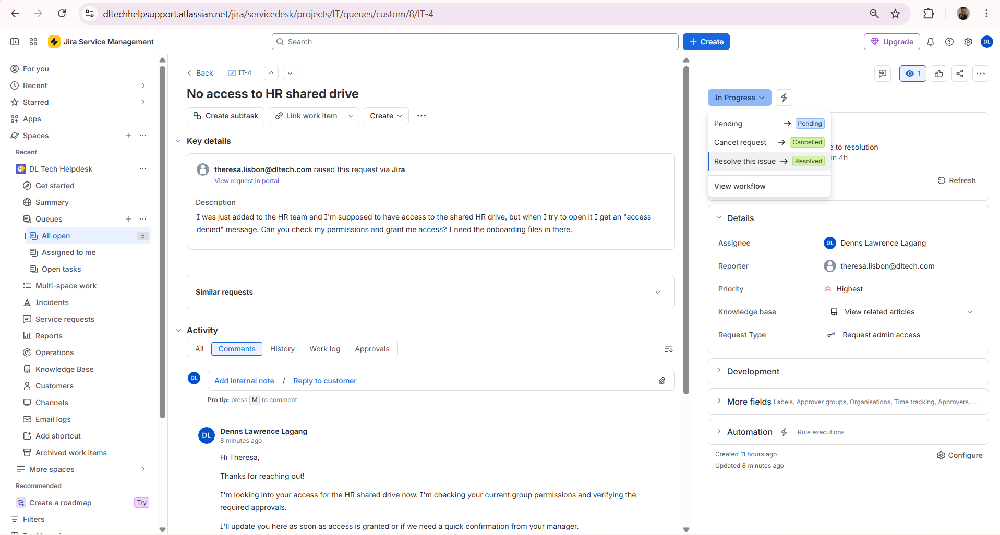
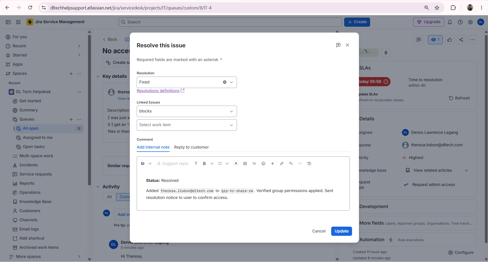
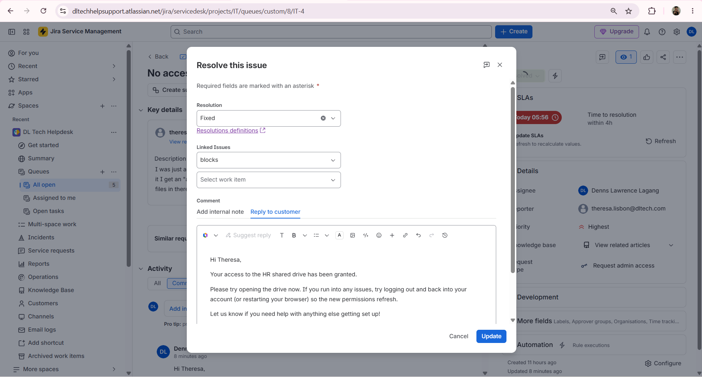
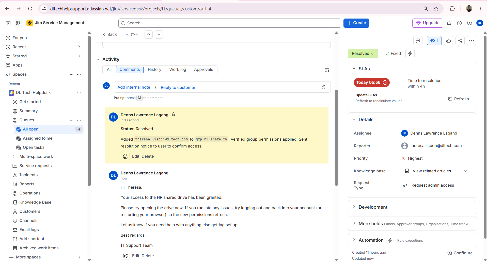

## What I Learned
- The difference between an internal note (agent-only, technical detail) and a customer-facing reply (professional, reassuring, no internal jargon) and why both matter in a real ticket.
- Priority is set by the support team based on actual business impact, not just taken at face value from how the requester phrased the request.
- How SLA policies tie to priority to automatically track response/resolution deadlines, and how pausing the clock while waiting on the customer keeps the SLA fair to the support team.
- A full ticket lifecycle: open → assigned → in progress → resolved, with documentation at each step.
